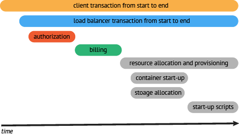

# Skywalking的学习
## APM概述
```
   APM(Application Performace Management)即应用性能管理系统，是对企业系统即使监控以实现对应程序性能管理和
故障管理的系统化的解决方案。应用性能管理，主要指对企业的关键业务应用进行监控，优化，提高企业应用的可靠性和质量，
保证用户得到良好的服务，降低IT总拥有成本.

```
* APM系统是可以帮助解决系统行为，用于分析性能问题的工具，一百年发生故障的时候，能够快速定位和解决问题.


### 分布式链路追踪
```text
随着分布式系统和微服务架构的出现，一次用户的请求会经过多个系统，不同的服务之间的调用关系十分的复杂，任何一个系统出错
都可能影响整个请求的处理结果。以往的监控系统往往只能知道单个系统的健康情况，一次请求的成功失败，无法快速定位失败的根
本原因。
除了上面的问题之外，复杂的分布式系统也面临下面的这些问题:
* 性能的分析：一个服务依赖很多的服务，被依赖的服务iye依赖其他的服务。如果某个接口耗时突然变长，那么未必是调用下游的服务变慢了，
也可以是下游的下游慢了了造成的，如何快速定位耗时编程的根本原因？
* 链路梳理:需求的迭代是很快的，系统之间调用关系变化也是非常频繁，靠人工很难梳理系统链路拓扑(系统之间的调用关系)
为了解决这些问题，Google推出了一个分布式链路追踪系统Dapper，之后各个互联网公司都参照Dapper的思想推出了自己的分
布式链路追踪系统，而这个歌系统就是分布式系统下的APM系统。


```

## 什么是OpenTrancing
```text
分布式链路追踪最先有Google在Dapper论文中提出的，而OpenTracing通过提高平台无关，厂商无关的API，使得开发
人员能够方便的添加(或者更换)追踪系统的实现。

```


```text
在一个分布式系统中，追踪一个事务或者调用流一般如上图所示。虽然这种图对于看清各组件的组合关系是很有用的，
但是，它存在两个问题：
1. 它不能很好显示组件的调用时间，是串行调用还是并行调用，如果展现更复杂的调用关系，会更加复杂，甚至
无法画出这样的图。
2.这种图也无法显示调用间的时间间隔以及是否通过定时调用来启动调用。
```
一种更有效的展现一个典型的trace过程，如下图所示：


```text
这种展现方式增加显示了执行时间的上下文，相关服务间的层次关系，进程或者任务的串行或并行调用关系。这样的视
图有助于发现系统调用的关键路径。通过关注关键路径的执行过程，项目团队可能专注于优化路径中的关键位置，最
大幅度的提升系统性能。例如：可以通过追踪一个资源定位的调用情况，明确底层的调用情况，发现哪些操作有阻塞
的情况。
```

## 流行的链路追踪系统
1. Pinpoint 
2. Skywalking
3. Zipkin
4. CAT

## Skywalking
```text
skywalking是一个可观测的分析平台(Observability Analysis Platform简称OAP)和应用程序性能管理
系统(Application Performance Management简称APM)。
提供分布式链路追踪，服务网格(Service Mesh)遥测分析，度量(Metric)聚合和可视化一体化解决方案.
Skywalking的几大特点:
* 多语言自动探针Java ，.NET，Node.JS,GOLANG,Python
* 多种监控手段，语言探针和service mesh
* 轻量高效，不需要额外的搭建大数据平台
* 模块化架构。UI，存储，集群管理多种机制可选。
* 支持告警.
* 优秀的可视化效果.
```


